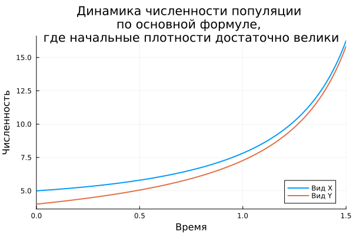
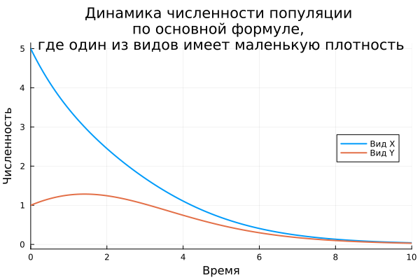
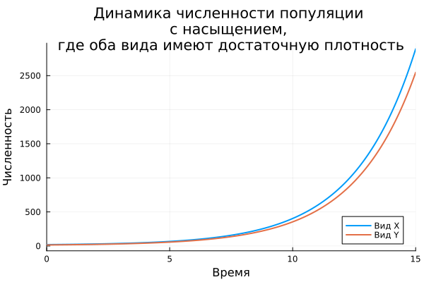
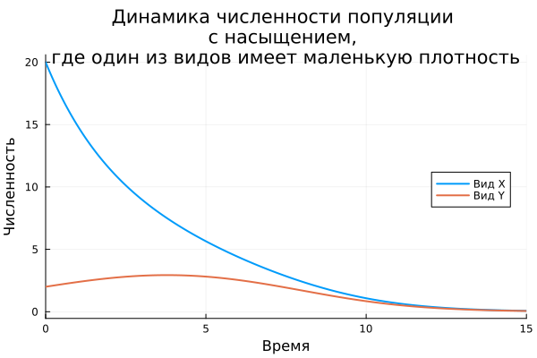
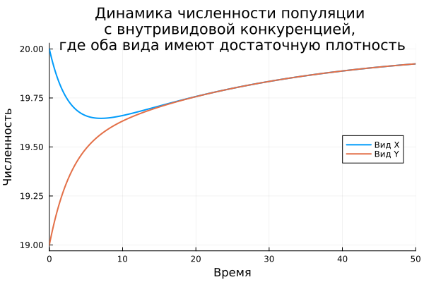
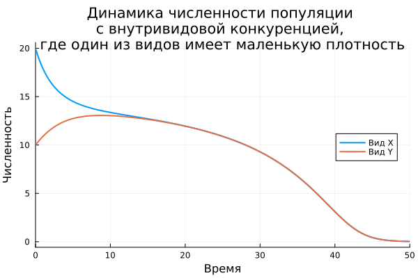

---
## Front matter
title: "Модель популяции"
subtitle: "Симбиоз. Мутуализм"
author: "Уткина Алина Дмитриевна"

## Generic options
lang: ru-RU
toc-title: "Оглавление"

## Bibliography
bibliography: bib/cite.bib
csl: pandoc/csl/gost-r-7-0-5-2008-numeric.csl

## Pdf output format
toc: true # Table of contents
toc-depth: 2
lof: true # List of figures
fontsize: 13pt
linestretch: 1.5
papersize: a4
documentclass: scrreprt
## I18n polyglossia
polyglossia-lang:
  name: russian
  options:
	- spelling=modern
	- babelshorthands=true
polyglossia-otherlangs:
  name: english
## I18n babel
babel-lang: russian
babel-otherlangs: english
## Fonts
mainfont: PT Serif
romanfont: PT Serif
sansfont: PT Sans
monofont: PT Mono
mainfontoptions: Ligatures=TeX
romanfontoptions: Ligatures=TeX
sansfontoptions: Ligatures=TeX,Scale=MatchLowercase
monofontoptions: Scale=MatchLowercase,Scale=0.9
## Biblatex
biblatex: true
biblio-style: "gost-numeric"
biblatexoptions:
  - parentracker=true
  - backend=biber
  - hyperref=auto
  - language=auto
  - autolang=other*
  - citestyle=gost-numeric
## Pandoc-crossref LaTeX customization
figureTitle: "Рис."
tableTitle: "Таблица"
listingTitle: "Листинг"
lofTitle: "Список иллюстраций"
lotTitle: "Список таблиц"
lolTitle: "Листинги"
## Misc options
indent: true
header-includes:
  - \usepackage{indentfirst}
  - \usepackage{float} # keep figures where there are in the text
  - \floatplacement{figure}{H} # keep figures where there are in the text
---


# Модель мутуализма

Мутуализм (от лат. mutuus «взаимный») — форма симбиоза двух или более видов, при которой взаимоотношение между организмами является жизненно необходимым для всех особей в симбиозе. 

Преимущества организмов, вступающих в мутуалистические отношения, могут быть различны. Один из партнёров может использовать другого в качестве поставщика пищи, а второй получать защиту от врагов или благоприятные для роста и размножения условия. В других случаях вид, выигрывающий в пище, освобождает партнёра от паразитов, опыляет растения или распространяет семена.

Тесный контакт видов при мутуализме вызывает их совместную эволюцию. Характерным примером служат взаимные приспособления, которые сформировались у цветковых растений и их опылителе.

Рассмотрим симбиотические отношения типа мутуализм, при котором межпопуляционные взаимодействия являются облигатными, т. е. необходимым условием существования каждого из видов, и в отсутствие партнера каждый из видов вымирает [@models].


## Основная формула модели

Изначально модель описывается системой уравнений

$$\begin{aligned}
x' &= -c_1 x + P_1 x y, \\
y' &= -c_2 y + P_2 x y,
\end{aligned}$$

В данной формуле:

- $x$, $y$ - численности (или биомассы) двух взаимодействующих популяций в момент времени $t$;
- $c_1$, $c_2$ - коэффициенты смертности. Они показывают, какая доля особей популяций $x$ и $y$ соответственно погибает за единицу времени (чем больше коэффициент $c$, тем выше смертность в этой популяции);
- $c_1x$, $c_2y$ описывают естественную смертность или уменьшение численности популяции в отсутствие взаимодействия с партнером;
- $P_1$ - насколько эффективно присутствие популяции $y$ способствует росту популяции $x$;
- $P_2$ - насколько эффективно присутствие популяции $x$ способствует росту популяции $y$;
- $P_1 x y$ и $P_2 x y$ описывают положительный эффект от мутуалистического взаимодействия между популяциями (рост каждой популяции тем выше, чем больше численность обеих популяций).

Каждая популяция в одиночку обречена на вымирание, так как смертность не компенсируется рождаемостью. Взаимодействие между популяциями является единственным фактором, который может привести к росту численности и поддержанию жизни обеих популяций.

Таким образом, система моделирует облигатный мутуализм, где выживание каждого вида напрямую зависит от присутствия другого.

Функция на языке Julia для данной формулы выглядит следующим образом:

```{.julia .numberLines}
function mutualism_1!(du, u, p, t)
    X, Y = u
    c1, c2, p1, p2 = p

    du[1] = -c1*X + p1*X*Y
    du[2] = -c2*Y + p2*X*Y
end
```

В зависимости от начальных значений плотностей популяций, график системы может выглядеть так: 

- обе популяции неограниченно размножаются за очень короткое время, если их начальные плотности достаточно велики;
- обе популяции вымирают, если хотя бы один из видов имеет маленькую плотность.

Например, для одних и тех же параметров смертности и влияния друг на друга ($c=0.6$, $p=0.2$) построим графики с разной начальной плотностью видов.

Для первого случая с достаточной плотностью популяции возьмем значения $x_0=5$ и $y_0=4$. Эти значения считаются достаточными для того, чтобы обе популяции быстро разрастались (рис. [-@fig:001]).  

```{.julia .numberLines}
X_0 = 5.0
Y_0 = 4.0
time = (0.0, 1.5)
params = [0.6, 0.6, 0.2, 0.2]

prob = ODEProblem(mutualism_1!, [X_0, Y_0], time, params)
sol = solve(prob, Tsit5(), reltol=1e-8, abstol=1e-8)

plt1 = plot(sol,
            linewidth=2,
            xlabel="Время",
            ylabel="Численность",
            label=["Вид X" "Вид Y"],
            title="Динамика численности популяции \nпо основной формуле, \nгде начальные плотности достаточно велики",
            legend=:bottomright)
```

Для второго случая возьмем значения $x_0=5$ и $y_0=1$, так как вторая популяция имеет маленькую плотность, обе популяции постепенно сокращаются и в итоге вымирают (рис. [-@fig:002]).  

```{.julia .numberLines}
X_0 = 5.0
Y_0 = 1.0
time = (0.0, 10.0)
params = [0.6, 0.6, 0.2, 0.2]

prob = ODEProblem(mutualism_1!, [X_0, Y_0], time, params)
sol = solve(prob, Tsit5(), reltol=1e-8, abstol=1e-8)

plt1 = plot(sol,
            linewidth=2,
            xlabel="Время",
            ylabel="Численность",
            label=["Вид X" "Вид Y"],
            title="Динамика численности популяции \nпо основной формуле, \nгде один из видов имеет маленькую плотность",
            legend=:right)
```

{#fig:001 width=70%}

{#fig:002 width=70%}

В этом проявляется неадекватность описания эффекта мутуализма. В реальной экосистеме рост не может быть бесконечным, его всегда ограничивают имеющиеся ресурсы (еда, вода, свет, пространство) и другие внешние факторы.


## Дополнение формулы фактором насыщения

Введем в формулу мутуализма фактор, аналогичный фактору насыщения хищника. Система при этом принимает вид 

$$\begin{aligned}
x' &= -c_1 x + \frac{P_1 x y}{1 + D_1 y},  \\
y' &= -c_2 y + \frac{P_2 x y}{1 + D_2 x},
\end{aligned}$$

Здесь к уже описанным ранее коэффициентам добавляются параметры, ограничивающие пользу, которую популяции приносят друг другу с их ростом: $D_1$ и $D_2$ - коэффициенты насыщения, они показывают, насколько быстро эффективность мутуализма падает с ростом численности партнера.

Таким образом, $P_i x y$ является потенциальной пользой от мутуализма, которая растет пропорционально произведению численностей, а $\frac{1}{1 + D_1 y}$ и $\frac{1}{1 + D_2 x}$ - ограничения, добавляющие системе немного адекватности, и описывают реальную пользу взаимодействия популяций.

Данная система на языке Julia:

```{.julia .numberLines}
function mutualism_2!(du, u, p, t)
    X, Y = u
    c1, c2, p1, p2, d1, d2 = p

    du[1] = -c1*X + p1*X*Y/(1+d1*Y)
    du[2] = -c2*Y + p2*X*Y/(1+d2*X)
end
```

Рассмотрим примеры, так же как и с основной формулой: возьмем одинаковые коэффициенты смертности и влияния друг на друга ($c=0.6$, $p=0.2$) и новые коэффициенты насыщения ($D=0.2$), и установим разные начальные плотности популяций.

Первый случай, когда плотности достаточно велики $x_0=20$ и $y_0=15$ (рис. [-@fig:003]). На графике мы видим, что с добавлением фактора насыщения, результат сильно не изменится, популяции все так же продолжают бесконечно расти, хоть и немного медленнее, чем до этого.

```{.julia .numberLines} 
X_0 = 20.0
Y_0 = 15.0
time = (0.0, 15.0)
params = (0.6, 0.6, 0.2, 0.2, 0.2, 0.2)

prob = ODEProblem(mutualism_2!, [X_0, Y_0], time, params)
sol = solve(prob, Tsit5(), reltol=1e-8, abstol=1e-8)

plt1 = plot(sol,
            linewidth=2,
            xlabel="Время",
            ylabel="Численность",
            label=["Вид X" "Вид Y"],
            title="Динамика численности популяции \nс насыщением, \nгде оба вида имеют достаточную плотность",
            legend=:bottomright)
```

Во втором случае возьмем $x_0=20$ и $y_0=1$ (рис. [-@fig:004]). В данном случае мы видим почти то же самое, как до добавления фактора насыщения.

```{.julia .numberLines}
X_0 = 5.0
Y_0 = 1.0
time = (0.0, 10.0)
params = (0.6, 0.6, 0.2, 0.2, 0.2, 0.2)

prob = ODEProblem(mutualism_2!, [X_0, Y_0], time, params)
sol = solve(prob, Tsit5(), reltol=1e-8, abstol=1e-8)

plt1 = plot(sol,
            linewidth=2,
            xlabel="Время",
            ylabel="Численность",
            label=["Вид X" "Вид Y"],
            title="Динамика численности популяции \nс насыщением, \nгде один из видов имеет маленькую плотность",
            legend=:right)
```

{#fig:003 width=70%}

{#fig:004 width=70%}

Так как изменения минимальные и модель все еще не достаточно реалистичная, необходимо дополнить ее дополнительными ограничениями.


## Дополнение формулы фактором внутривидовой конкуренции

Для еще более реального описания динамики двух мутуалистаческих популяций можно ввести дополнительно в рассмотрение фактор
внутривидовой конкуренции. Теперь система принимает вид 

$$\begin{aligned}
x' &= -c_1 x + \frac{P_1 x y}{1 + D_1 y} - e_1 x^2,  \\
y' &= -c_2 y + \frac{P_2 x y}{1 + D_1 x} - e_2 y^2,
\end{aligned}$$

В данной системе добавляются $e_1$ и $e_2$ - коэффициенты внутривидовой конкуренции. Таким образом $-e_1x^2$ и $-e_2y^2$ показывают, что скорость снижения численности популяций пропорциональна квадрату их собственной численности. Это означает, что чем больше особей в популяции, тем сильнее они мешают друг другу и конкурируют за ограниченные ресурсы. И чем больше коэффициент $e_i$, тем сильнее эта конкуренция внутри популяции.

Функция на Julia:

```{.julia .numberLines}
function mutualism_3!(du, u, p, t)
    X, Y = u
    c1, c2, p1, p2, d1, d2, e1, e2 = p

    du[1] = -c1*X + p1*X*Y/(1+d1*Y) - e1*X*X
    du[2] = -c2*Y + p2*X*Y/(1+d2*X) - e2*Y*Y
end
```

Как и в предыдущих примерах построим графики с одинаковыми коэффициентами, добавив $e=0.01$ и разными начальными плотностями популяций.

Первый вариант с достаточной плотностью обоих видов - $x_0=20$ и $y_0=19$ (рис. [-@fig:005]).

```{.julia .numberLines}
X_0 = 20.0
Y_0 = 19.0
time = (0.0, 50.0)
params = (0.6, 0.6, 0.2, 0.2, 0.2, 0.2, 0.01, 0.01)

prob = ODEProblem(mutualism_3!, [X_0, Y_0], time, params)
sol = solve(prob, Tsit5(), reltol=1e-8, abstol=1e-8)

plt1 = plot(sol,
            linewidth=2,
            xlabel="Время",
            ylabel="Численность",
            label=["Вид X" "Вид Y"],
            title="Динамика численности популяции \nс внутривидовой конкуренцией, \nгде оба вида имеют достаточную плотность",
            legend=:right)
```

И второй вариант с маленькой плотностью одного из двух видов - $x_0=20$ и $y_0=10$ (рис. [-@fig:006]).

```{.julia .numberLines}
X_0 = 20.0
Y_0 = 10.0
time = (0.0, 50.0)
params = (0.6, 0.6, 0.2, 0.2, 0.2, 0.2, 0.01, 0.01)

prob = ODEProblem(mutualism_3!, [X_0, Y_0], time, params)
sol = solve(prob, Tsit5(), reltol=1e-8, abstol=1e-8)

plt1 = plot(sol,
            linewidth=2,
            xlabel="Время",
            ylabel="Численность",
            label=["Вид X" "Вид Y"],
            title="Динамика численности популяции \nс внутривидовой конкуренцией, \nгде один из видов имеет маленькую плотность",
            legend=:right)
```

{#fig:005 width=70%}

{#fig:006 width=70%}

Теперь можно заметить, что вариант с внутривидовой конкуренцией и достаточной численностью обеих популяций выглядит более правдоподобно за счет установленных ограничений роста популяций, и численность этих популяций не уходит в бесконечность, а стремится к определенному балансному уровню. 
 


# Вывод{.unnumbered}

При выполнении данной работы были рассмотрены основная формула модели мутуализма и ее модификации, коэффициенты и их влияние на поведение графиков системы, проведено сравнение при различных исходных значениях и наличии/отсутствии этих коэффициентов.

# Список источников{.unnumbered}
::: {#refs}
:::


